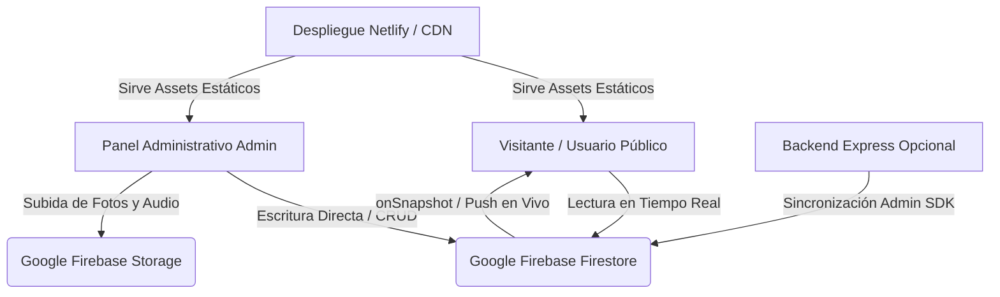

# 📋 FICHA TÉCNICA DEL SISTEMA: TERMALES JAMANCO WEB & CLOUD

---

## 1. 📌 INFORMACIÓN GENERAL DEL PROYECTO

| Parámetro | Detalle |
| :--- | :--- |
| **Nombre del Sistema** | Plataforma Web Turística & Panel Administrativo Cloud - Termales Jamanco |
| **Versión** | 1.0.0 (Producción / Cloud Ready) |
| **Tipo de Aplicación** | Single Page Application (SPA) + Cloud Firestore Realtime + API RESTful |
| **Entorno de Despliegue** | Netlify (Producción Web) / Node.js Express (Backend Opcional) / Google Cloud |
| **Base de Datos Principal** | Google Firebase Cloud Firestore (Base de datos NoSQL en tiempo real) |
| **Almacenamiento de Archivos** | Google Firebase Cloud Storage (Imágenes y Audios) |
| **Sector / Industria** | Turismo, Ecoturismo, Termalismo, Gastronomía y Hospedaje |
| **Ubicación de Referencia** | Papallacta, Napo, Ecuador |

---

## 2. 🏗️ ARQUITECTURA DEL SISTEMA

El sistema cuenta con una arquitectura híbrida desacoplada **Cliente-Nube (Serverless + Realtime DB)**:



### Principios de Diseño:
1. **Sincronización en Tiempo Real (`onSnapshot`)**: Cualquier cambio efectuado en el panel administrativo se replica inmediatamente en la pantalla de todos los visitantes conectados sin necesidad de recargar la página.
2. **Tolerancia a Fallos & Modo Híbrido**: Puede operar como SPA 100% estática en Netlify conectada a Google Cloud Firestore o con servidor Node.js local.
3. **Diseño Responsive & Accesible**: Optimizado para dispositivos móviles, tablets y computadoras de escritorio.

---

## 3. 💻 STACK TECNOLÓGICO

### 3.1 Frontend (Cliente Web)
- **Librería Principal**: React 18.3.1 (Arquitectura basada en componentes funcionales y Hooks personalizados).
- **Herramienta de Construcción (Bundler)**: Vite 5.4.x (Compilación ultrarrápida, Hot Module Replacement - HMR, optimización Rollup).
- **Estilos & Diseño Visual**: Vanilla CSS con variables de diseño personalizadas (Glassmorphism, Dark/Luminous Mode, paleta andina termal, microanimaciones CSS3).
- **Iconografía**: `lucide-react` (iconos vectoriales ligeros y escalables).
- **Efectos Interactivos**: `canvas-confetti` (microinteracciones en cotizaciones y reservas).
- **Audio Web**: HTML5 Audio API con control de volumen, fading y persistencia de estado.

### 3.2 Backend & Servicios Cloud
- **SDK de Cliente**: `firebase` 12.x (Firestore, Storage, App).
- **SDK de Servidor (Opcional)**: `firebase-admin` 14.x (Acceso mediante Service Account con credenciales privadas).
- **Servidor Web Local**: Express 5.2.x sobre Node.js (con soporte para Server-Sent Events - SSE).
- **Seguridad & Criptografía**:
  - `jsonwebtoken` (JWT): Autenticación basada en tokens para administradores.
  - `bcryptjs`: Encriptación de contraseñas administrativas.
- **Manejo de Archivos**: `multer` para recepción de payloads multipart/form-data.
- **Gestión de Procesos Concurrentes**: `concurrently` 10.x.

---

## 4. 🧩 MÓDULOS DEL SISTEMA

### 4.1 Módulos del Sitio Público (Front-Office)
1. **Navbar & Floating Audio Player**: Barra de navegación con desplazamiento suave y reproductor de sonido ambiental andino.
2. **Hero Cinematográfico**: Portada con badges de temperatura en tiempo real (37°C a 44°C), distancias y llamados a la acción.
3. **Circuito Termal & Minerales**: Desglose interactivo de los componentes terapéuticos (Calcio, Sulfatos, Magnesio).
4. **Explorador de Sedes**: Fichas dinámicas de *Terjamanco 1*, *Terjamanco 2*, *El Mirador Jamanco*, *Hospedaje* y *Restaurante*.
5. **Catálogo de Servicios & Tarifas**: Sistema de filtrado por categorías con precios por adulto/niño y desglose de inclusiones.
6. **Tienda Jamanco**: Vitrina de productos y recuerdos disponibles en las instalaciones.
7. **Paquetes & Cotizador WhatsApp**: Generador de enlaces dinámicos hacia la API de WhatsApp con mensajes preformateados.
8. **Galería Fotográfica Lightbox**: Álbum con filtro por sedes y vista en pantalla completa.
9. **Módulo RoadTrip & Rutas GPS**: Guía de conducción desde Quito/Pifo con enlaces directos a Google Maps y Waze.
10. **Reseñas & FAQs**: Muro de testimonios de clientes y acordeón de preguntas frecuentes.

### 4.2 Módulos del Panel Administrativo (Back-Office `/admin`)
1. **Control de Acceso (Auth)**: Autenticación mediante credenciales con sesión persistente.
2. **Gestión de Información General**: Edición de teléfonos, WhatsApp, horarios, correos y redes sociales.
3. **Gestión de Portada (Hero)**: Control de títulos, subtítulos, badges y foto principal.
4. **CRUD de Sedes & Complejos**: Alta, baja, modificación y reordenamiento de sedes.
5. **CRUD de Servicios & Tarifas**: Configuración de precios, horarios, categorías y etiquetas destacadas.
6. **CRUD de Productos**: Administración del catálogo de tienda y disponibilidad.
7. **CRUD de Paquetes Promocionales**: Configuración de ofertas, precios especiales y textos de WhatsApp.
8. **Gestor de Galería & Media**: Subida directa de imágenes a la nube (Cloud Storage) y categorización.
9. **Moderación de Reseñas**: Aprobación, creación y edición de comentarios y valoraciones por estrellas.
10. **Gestor de Preguntas Frecuentes**: Edición de contenido para el acordeón público.
11. **Control de Audio Ambiental**: Configuración de pistas `.mp3`, pista activa y volumen inicial.
12. **Centro de Control Cloud & Seguridad**:
    - Monitor de estado de conexión con Google Firebase.
    - Sincronización masiva de datos locales hacia Cloud Firestore (**🚀 Sync to Firebase**).
    - Motor de Respaldo y Restauración (**Backup / Restore JSON**).
    - Cambio de credenciales de administrador.
    - Botón de Restauración de Fábrica (Factory Reset).

---

## 5. 🔒 SEGURIDAD Y PROTECCIÓN DE DATOS

| Vector de Seguridad | Mecanismo Implementado |
| :--- | :--- |
| **Autenticación** | Tokens JWT firmados con clave secreta y expiración configurable. |
| **Almacenamiento de Contraseñas** | Hashing criptográfico mediante `bcryptjs` (salt rounds). |
| **Reglas de Acceso Cloud** | Reglas de seguridad en Firestore y Storage para lectura pública y escritura controlada. |
| **Sanitización de Archivos** | Validación de tipos MIME (imágenes JPEG/PNG/WebP y audios MP3) y nombres de archivo sanitizados. |
| **Prevención de Ataques XSS / Inyección** | React DOM Virtual Rendering (escape automático de cadenas HTML) y serialización controlada de objetos JSON. |
| **Comunicaciones Seguras** | Transporte cifrado mediante protocolo HTTPS / WSS en producción. |

---

## 6. ⚙️ REQUISITOS DEL SISTEMA

### 6.1 Requisitos de Servidor / Hosting
- **Hosting Estático (Recomendado)**: Netlify, Vercel, Firebase Hosting o AWS S3/CloudFront.
- **Servidor Backend (Opcional)**: Node.js versión 18.x o superior.
- **Base de Datos**: Google Firebase (Plan Spark gratuito o Plan Blaze).

### 6.2 Requisitos del Cliente (Navegadores Compatibles)
- Google Chrome versión 90 o superior.
- Mozilla Firefox versión 88 o superior.
- Apple Safari versión 14 o superior (iOS y macOS).
- Microsoft Edge versión 90 o superior.
- Navegadores móviles Android e iOS actualizados.

---

## 7. 📁 ESTRUCTURA DEL PROYECTO

```text
ARSA/Jan/
├── .env                              # Variables de entorno y credenciales Cloud
├── netlify.toml                      # Configuración de despliegue y redirecciones Netlify
├── package.json                      # Dependencias y scripts del proyecto
├── vite.config.js                    # Configuración de Vite y plugins React
├── MANUAL_DE_USO.md                  # Manual de uso para usuarios y administradores
├── FICHA_TECNICA.md                  # Especificaciones técnicas del sistema
├── public/                           # Recursos estáticos (logos, audios, favicon)
├── server/                           # Backend Express & Utilidades Firebase Admin
│   ├── config/                       # Claves de servicio (serviceAccountKey.json)
│   ├── data/                         # Base de datos local de respaldo (db.json)
│   ├── routes/                       # Rutas de la API REST (auth, upload, api)
│   ├── utils/                        # Controladores de base de datos y Firebase Admin
│   └── server.js                     # Servidor Node.js Express principal
└── src/                              # Código Fuente del Frontend React
    ├── admin/                        # Panel de control administrativo
    │   ├── AdminDashboard.jsx        # Contenedor principal del panel
    │   └── tabs/                     # Pestañas de gestión (Info, Hero, Zones, Settings, etc.)
    ├── components/                   # Componentes reutilizables (Navbar, Audio, Galería, RoadTrip)
    ├── context/                      # Contexto global de estado (SiteDataContext.jsx)
    ├── data/                         # Datos iniciales oficiales (terjamancoData.js)
    ├── services/                     # Servicios de comunicación (api.js, firebase.js)
    ├── App.jsx                       # Componente raíz de la aplicación
    └── main.jsx                      # Punto de entrada de React
```

---

## 8. 🌐 VARIABLES DE ENTORNO REQUERIDAS

```env
# Backend Node.js
PORT=5000
JWT_SECRET=tu_clave_secreta_jwt

# Google Firebase Cloud (terjamancoweb)
VITE_FIREBASE_API_KEY=AIzaSy...
VITE_FIREBASE_PROJECT_ID=terjamancoweb
VITE_FIREBASE_AUTH_DOMAIN=terjamancoweb.firebaseapp.com
VITE_FIREBASE_STORAGE_BUCKET=terjamancoweb.firebasestorage.app
VITE_FIREBASE_MESSAGING_SENDER_ID=1096293222402
VITE_FIREBASE_APP_ID=1:1096293222402:web:...
```
